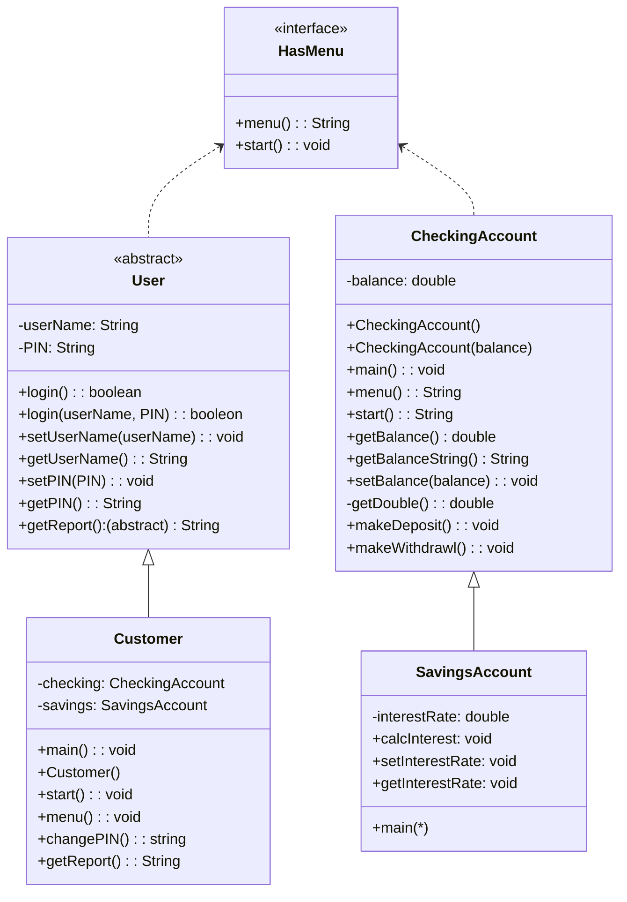

HasMenu
interface HasMenu 
  ====================
  ====================
  string menu()
  void start()

CheckingAccount
class CheckingAccount implements HasMenu
  ====================
    double balance
  ====================
    CheckingAccount()
    CheckingAccount(double balance)
    main()
    string menu()
    void start()   
    double getBalance()
    string getBalanceString()
    void setBalance(double balance)
    void checkBalance()
    private double getDouble()
    void makeDeposit()
    void makeWithdrawal
  ====================

SavingsAccount
class SavingsAccount extends CheckingAccount
  ====================
    double interestRate
  ====================
    main()
    calcInterest()
    void setInterestRate()
    double getInterestRate()
  ====================

User
abstract class User implements HasMenu, Serializable
  ====================
    string userName
    string PIN
  ====================
    boolean login()
    boolean login(userName, PIN)
    void setUserName(userName)
    string getUserName()
    void setPIN(PIN)
    string getPIN()
    abstract string getReport()
  ====================

Customer
class Customer extends User
  ====================
    CheckingAccount checking 
    SavingsAccount savings 
  ====================
    void main()
    Customer()
    Customer(usernName, PIN)
    void start()
    string menu()
    void changePin()
    string getReport()
  ====================

