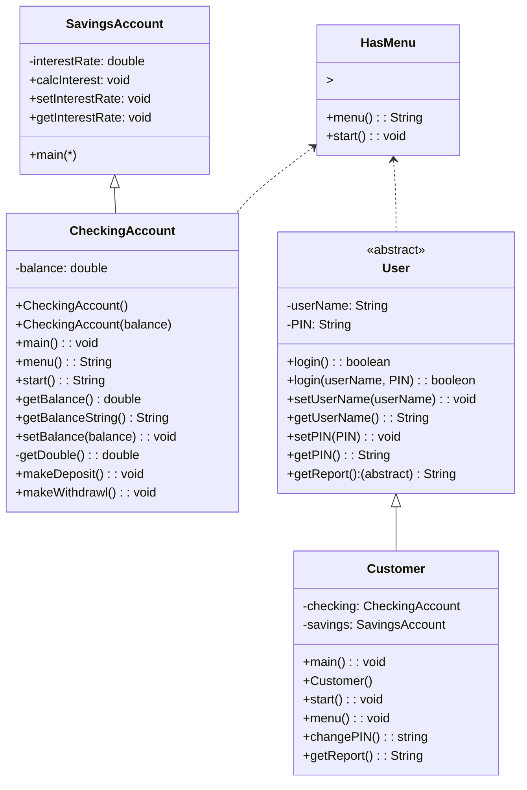

```mermaid

classDiagram

	class CheckingAccount{
	    -balance: double
		+CheckingAccount()
		+CheckingAccount(balance)
		+main(): void
		+menu(): String
		+start(): String
		+getBalance() double
		+getBalanceString() String
		+setBalance(balance): void
		-getDouble(): double
		+makeDeposit(): void
		+makeWithdrawl(): void
	}

    class HasMenu{
        <interface>>
        +menu(): String
        +start(): void
    }
    
    class SavingsAccount{
        -interestRate: double
        +main(*)
        +calcInterest: void
        +setInterestRate: void
        +getInterestRate: void
    }    
    
	class Customer{
        -checking: CheckingAccount
        -savings: SavingsAccount
        +main(): void
        +Customer()
        +start(): void
        +menu(): void
        +changePIN(): string
        +getReport(): String
    }

    class User{
        <<abstract>>
        -userName: String
        -PIN: String
        +login(): boolean 
        +login(userName, PIN): booleon
        +setUserName(userName): void
        +getUserName(): String
        +setPIN(PIN): void
        +getPIN(): String
        +getReport(): (abstract)String
    }
    
    SavingsAccount <|-- CheckingAccount
    User <|-- Customer
    HasMenu <.. User
    HasMenu <.. CheckingAccount
    
```
