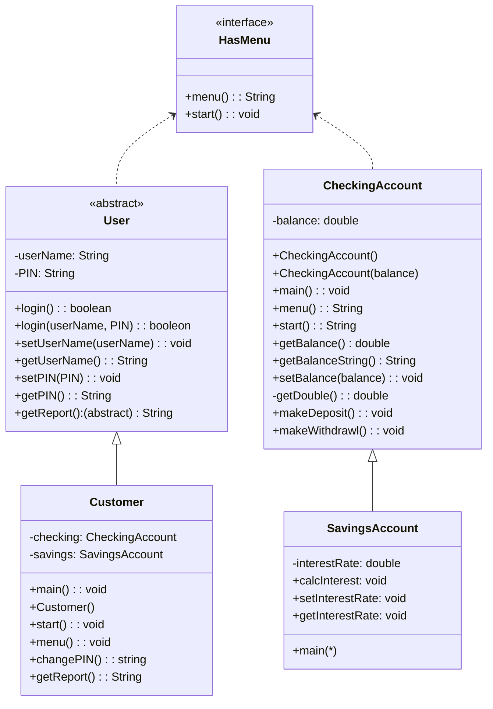

HasMenu
interface HasMenu 
  ====================
  ====================
  string menu()
  void start()

CheckingAccount
class CheckingAccount implements HasMenu
  ====================
    double balance
  ====================
    CheckingAccount(){
    balance = 0.0

    CheckingAccount(double balance){
    balance = balance

    main(){
    new CheckingAccount

    string menu(){
    print options 
    input option

    void start(){
    while bool keepgoing
    if 0
        false
    else 1
        checkBalaance
    else 2
        makedeposit
    else 3
        makewithdrawl
    else
        print invalid        
   
    double getBalance(){
        return balance

    string getBalanceString(){
        return string format balance

    void setBalance(double balance){
        balnace = balance

    void checkBalance(){
        print balance

    private double getDouble(){
        try double parsedouble input
        exception print invalid return 0

    void makeDeposit(){
        print enter deposit amount
        double  input
        if input > 0
            balance + depo amount
        else
            print invalid
        
    void makeWithdrawal(){
        print enter withdrawl amount
        double input
        if input > 0 and < balance
            balance - input
        else
            print invalid
            
  ====================

SavingsAccount
class SavingsAccount extends CheckingAccount
  ====================
    double interestRate
  ====================
    main()
    calcInterest(){
        double interest =getBalance * intrestrate
        setbalnce (getbalnce + interest)

    void setInterestRate(intrate){
        interestrate = intrate

    double getInterestRate(){
        return intrestRate
  ====================

User
abstract class User implements HasMenu, Serializable
  ====================
    string userName
    string PIN
  ====================
    boolean login()
    boolean login(userName, PIN)
    void setUserName(userName)
    string getUserName()
    void setPIN(PIN)
    string getPIN()
    abstract string getReport()
  ====================

Customer
class Customer extends User
  ====================
    CheckingAccount checking 
    SavingsAccount savings 
  ====================
    void main()
    Customer()
    Customer(usernName, PIN)
    void start()
    string menu()
    void changePin()
    string getReport()
  ====================

